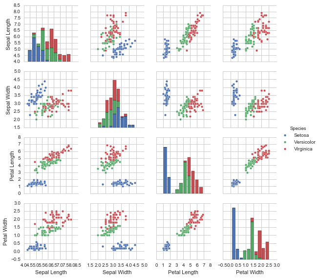
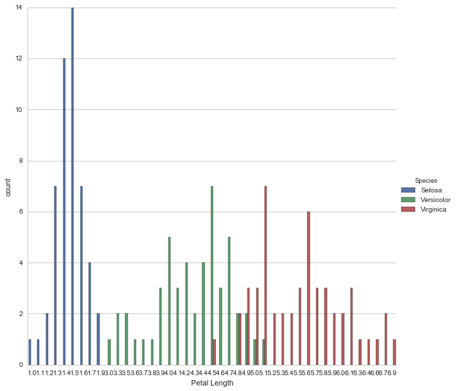
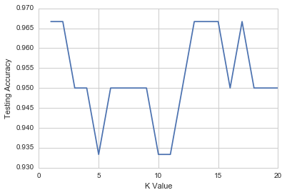

## Multi-Class Classification
DataSet used is the famous Iris Dataset. The data set consists of 50 samples from each of three species of Iris (Iris setosa, Iris virginica and Iris versicolor), so 150 total samples. Four features were measured from each sample: the length and the width of the sepals and petals, in centimetres.


```python
#Data imports
import numpy as np
import pandas as pd
from pandas import Series, DataFrame

#Plot imports
import matplotlib.pyplot as plt
import seaborn as sns
sns.set_style('whitegrid')

%matplotlib inline
```


```python
#Load the dataset from scikit learn
from sklearn import linear_model
from sklearn.datasets import load_iris
```


```python
iris = load_iris()
```


```python
X = iris.data

Y = iris.target
```


```python
print(iris.DESCR)
```

    Iris Plants Database
    
    Notes
    -----
    Data Set Characteristics:
        :Number of Instances: 150 (50 in each of three classes)
        :Number of Attributes: 4 numeric, predictive attributes and the class
        :Attribute Information:
            - sepal length in cm
            - sepal width in cm
            - petal length in cm
            - petal width in cm
            - class:
                    - Iris-Setosa
                    - Iris-Versicolour
                    - Iris-Virginica
        :Summary Statistics:
    
        ============== ==== ==== ======= ===== ====================
                        Min  Max   Mean    SD   Class Correlation
        ============== ==== ==== ======= ===== ====================
        sepal length:   4.3  7.9   5.84   0.83    0.7826
        sepal width:    2.0  4.4   3.05   0.43   -0.4194
        petal length:   1.0  6.9   3.76   1.76    0.9490  (high!)
        petal width:    0.1  2.5   1.20  0.76     0.9565  (high!)
        ============== ==== ==== ======= ===== ====================
    
        :Missing Attribute Values: None
        :Class Distribution: 33.3% for each of 3 classes.
        :Creator: R.A. Fisher
        :Donor: Michael Marshall (MARSHALL%PLU@io.arc.nasa.gov)
        :Date: July, 1988
    
    This is a copy of UCI ML iris datasets.
    http://archive.ics.uci.edu/ml/datasets/Iris
    
    The famous Iris database, first used by Sir R.A Fisher
    
    This is perhaps the best known database to be found in the
    pattern recognition literature.  Fisher's paper is a classic in the field and
    is referenced frequently to this day.  (See Duda & Hart, for example.)  The
    data set contains 3 classes of 50 instances each, where each class refers to a
    type of iris plant.  One class is linearly separable from the other 2; the
    latter are NOT linearly separable from each other.
    
    References
    ----------
       - Fisher,R.A. "The use of multiple measurements in taxonomic problems"
         Annual Eugenics, 7, Part II, 179-188 (1936); also in "Contributions to
         Mathematical Statistics" (John Wiley, NY, 1950).
       - Duda,R.O., & Hart,P.E. (1973) Pattern Classification and Scene Analysis.
         (Q327.D83) John Wiley & Sons.  ISBN 0-471-22361-1.  See page 218.
       - Dasarathy, B.V. (1980) "Nosing Around the Neighborhood: A New System
         Structure and Classification Rule for Recognition in Partially Exposed
         Environments".  IEEE Transactions on Pattern Analysis and Machine
         Intelligence, Vol. PAMI-2, No. 1, 67-71.
       - Gates, G.W. (1972) "The Reduced Nearest Neighbor Rule".  IEEE Transactions
         on Information Theory, May 1972, 431-433.
       - See also: 1988 MLC Proceedings, 54-64.  Cheeseman et al"s AUTOCLASS II
         conceptual clustering system finds 3 classes in the data.
       - Many, many more ...
    
    


```python
#Put the data into a Pandas DataFrame
iris_data = DataFrame(X, columns=['Sepal Length','Sepal Width','Petal Length','Petal Width'])
```


```python
iris_target = DataFrame(Y, columns=['Species'])
```


```python
# Rename target values from 0,1,2 to Setosa, Versicolor, Virginica
def flower(num):
    if num==0:
        return 'Setosa'
    elif num==1:
        return 'Versicolor'
    else:
        return 'Virginica'
```


```python
iris_target['Species'] = iris_target['Species'].apply(flower)
```


```python
iris_target.tail()
```


<div>
<table border="1" class="dataframe">
  <thead>
    <tr style="text-align: right;">
      <th></th>
      <th>Species</th>
    </tr>
  </thead>
  <tbody>
    <tr>
      <th>145</th>
      <td>Virginica</td>
    </tr>
    <tr>
      <th>146</th>
      <td>Virginica</td>
    </tr>
    <tr>
      <th>147</th>
      <td>Virginica</td>
    </tr>
    <tr>
      <th>148</th>
      <td>Virginica</td>
    </tr>
    <tr>
      <th>149</th>
      <td>Virginica</td>
    </tr>
  </tbody>
</table>
</div>


```python
iris = pd.concat([iris_data, iris_target], axis = 1)
```


```python
iris.head()
```


<div>
<table border="1" class="dataframe">
  <thead>
    <tr style="text-align: right;">
      <th></th>
      <th>Sepal Length</th>
      <th>Sepal Width</th>
      <th>Petal Length</th>
      <th>Petal Width</th>
      <th>Species</th>
    </tr>
  </thead>
  <tbody>
    <tr>
      <th>0</th>
      <td>5.1</td>
      <td>3.5</td>
      <td>1.4</td>
      <td>0.2</td>
      <td>Setosa</td>
    </tr>
    <tr>
      <th>1</th>
      <td>4.9</td>
      <td>3.0</td>
      <td>1.4</td>
      <td>0.2</td>
      <td>Setosa</td>
    </tr>
    <tr>
      <th>2</th>
      <td>4.7</td>
      <td>3.2</td>
      <td>1.3</td>
      <td>0.2</td>
      <td>Setosa</td>
    </tr>
    <tr>
      <th>3</th>
      <td>4.6</td>
      <td>3.1</td>
      <td>1.5</td>
      <td>0.2</td>
      <td>Setosa</td>
    </tr>
    <tr>
      <th>4</th>
      <td>5.0</td>
      <td>3.6</td>
      <td>1.4</td>
      <td>0.2</td>
      <td>Setosa</td>
    </tr>
  </tbody>
</table>
</div>


### Data Visualization Analysis


```python
sns.pairplot(iris, hue='Species', size=2)
```


    <seaborn.axisgrid.PairGrid at 0x3c623e4320>





With the Pairplot, we see that Setosa has the most distinct features of the three species

Next we cam make histograms of all the species on a particular feature


```python
sns.factorplot('Petal Length', data=iris, hue='Species', size = 8, kind = 'count')
```


    <seaborn.axisgrid.FacetGrid at 0x3c6379bf98>





### Multi-class Classification with Sci Kit Learn


```python
#Import SciKit  Learn Logistic Regression
from sklearn.linear_model import LogisticRegression
from sklearn.cross_validation import train_test_split
```


```python
logreg = LogisticRegression()

X_train, X_test, Y_train, Y_test = train_test_split(X,Y,test_size=0.4,random_state=3)
```


```python
logreg.fit(X_train,Y_train)
```


    LogisticRegression(C=1.0, class_weight=None, dual=False, fit_intercept=True,
              intercept_scaling=1, max_iter=100, multi_class='ovr', n_jobs=1,
              penalty='l2', random_state=None, solver='liblinear', tol=0.0001,
              verbose=0, warm_start=False)


```python
from sklearn import metrics
```


```python
#Prediction from X_test
Y_pred = logreg.predict(X_test)
```


```python
#Check accuracy of the model
print(metrics.accuracy_score(Y_test,Y_pred))
```

    0.933333333333
    

Our model has about 93% accuracy

### Using K-Nearest Neighbors Algorithm for Classification
We will use the Sci Kit Learn package to implement the kNN algorithm


```python
from sklearn.neighbors import KNeighborsClassifier
```


```python
knn = KNeighborsClassifier(n_neighbors=6)
```


```python
knn.fit(X_train,Y_train)
```


    KNeighborsClassifier(algorithm='auto', leaf_size=30, metric='minkowski',
               metric_params=None, n_jobs=1, n_neighbors=6, p=2,
               weights='uniform')


```python
Y_pred = knn.predict(X_test)
```


```python
print(metrics.accuracy_score(Y_test,Y_pred))
```

    0.95
    

Using 6 nearest neighbors, we obtain a test accuracy of 95%

Lets see what we get if we use 1 nearest neighbor


```python
knn = KNeighborsClassifier(n_neighbors=1)
knn.fit(X_train,Y_train)
```


    KNeighborsClassifier(algorithm='auto', leaf_size=30, metric='minkowski',
               metric_params=None, n_jobs=1, n_neighbors=1, p=2,
               weights='uniform')


```python
Y_pred = knn.predict(X_test)
```


```python
print(metrics.accuracy_score(Y_test,Y_pred))
```

    0.966666666667
    

Using 1 nearest neighbor, we obtain an accuracy of 96.7%

To find the optimal k value, we cycle through various k values


```python
k_range = range(1,21)

accuracy = []
```


```python
for k in k_range:
    knn = KNeighborsClassifier(n_neighbors=k)
    knn.fit(X_train,Y_train)
    Y_pred = knn.predict(X_test)
    accuracy.append(metrics.accuracy_score(Y_test,Y_pred))   
```


```python
plt.plot(k_range,accuracy)
plt.xlabel('K Value')
plt.ylabel('Testing Accuracy')
```


    <matplotlib.text.Text at 0x3c65370d68>





```python

```


```python

```
